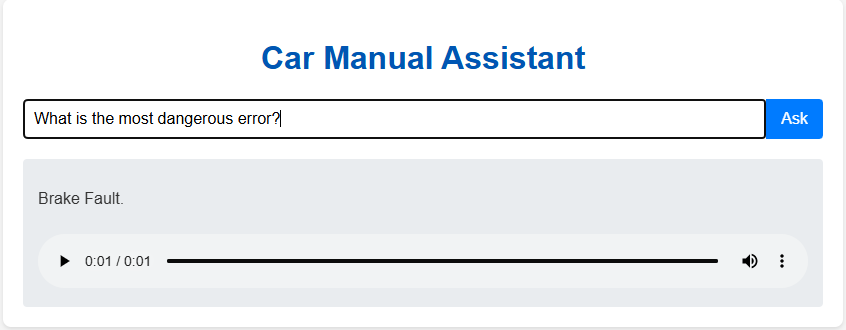

# Building RAG Chatbots for Technical Documentation

This project demonstrates the implementation of a Retrieval-Augmented Generation (RAG) chatbot capable of answering questions about technical documentation. The proof-of-concept is a context-aware car assistant that explains dashboard warnings using a car manual.

## Project Overview

### Purpose

The primary goal of this project is to build an intelligent chatbot that can understand and answer user queries based on a specific set of documents. It showcases how to augment a large language model with external knowledge, enabling it to provide accurate answers from a given technical manual instead of relying solely on its pre-trained data.

### What It Achieves

This project successfully builds a complete, offline RAG pipeline that:
- Ingests and processes technical documentation from an HTML file.
- Generates vector embeddings from the document content and stores them for efficient retrieval.
- Responds to a user's natural language question with a concise and relevant answer sourced from the document.
- Converts the generated text answer into speech, demonstrating a use-case for a hands-free interface.

## Real-World Applications

This technology can be adapted for numerous real-world scenarios:

-   **In-Vehicle Assistants**: Provide drivers with hands-free access to information about their vehicle, from warning lights to feature explanations.
-   **Customer Support Automation**: Power chatbots that can answer customer questions by drawing from product manuals and knowledge bases, reducing wait times.
-   **Corporate Knowledge Management**: Enable employees to quickly search through internal documentation, reports, and wikis.
-   **Educational Tools**: Create interactive study aids that help students understand complex topics by answering questions based on textbook material.

## How to Run the Application

This project includes a web-based interface built with Flask. Follow these steps to run it locally.

### Prerequisites
- Python 3.9+
- A virtual environment (recommended)

### 1. Installation

First, set up a virtual environment and activate it. Then, install the required dependencies from the project's root directory:

```bash
pip install -r requirements.txt
```
**Note:** This installation can take a while as it includes PyTorch and the Coqui TTS models, which are necessary for offline text-to-speech generation.

### 2. Running the Server

Once the dependencies are installed, start the Flask web server:

```bash
python app.py
```

You should see output indicating that the server is running, typically on `http://127.0.0.1:5000/`.

### 3. Accessing the Interface

Open your web browser and navigate to the URL provided in the terminal (e.g., `http://127.0.0.1:5000/`).

## Interface Functionality



The web interface provides a simple and intuitive way to interact with the RAG chatbot:

-   **Question Input**: A text box where you can type your questions about the car manual.
-   **Ask Button**: Submits your question to the chatbot.
-   **Response Area**: After a brief processing time, the chatbot's text-based answer will appear here.
-   **Audio Playback**: Along with the text, an audio player will appear, which will automatically play the spoken version of the answer. You can also use the player controls to listen to it again.

## Technology Stack

This project utilizes open-source and local technologies to ensure privacy and cost-effectiveness.

-   **Web Framework**: **Flask** provides the backend for the web application.
-   **Core Framework**: **LangChain** is used to orchestrate the entire RAG pipeline, connecting the different components in a modular way.
-   **Language Model (LLM)**: **`google/flan-t5-base`**, a model from Hugging Face, runs locally for answer generation. This avoids reliance on external APIs and associated costs.
-   **Embedding Model**: **`sentence-transformers/all-MiniLM-L6-v2`** is used for creating text embeddings. Its efficiency makes it suitable for running on local CPU.
-   **Vector Store**: **Chroma DB** serves as the vector database to store and retrieve document embeddings quickly.
-   **Document Loader**: **UnstructuredHTMLLoader** is used to parse the content from the source HTML file.
-   **Text-to-Speech**: **Coqui TTS** is used for high-quality, offline text-to-speech generation.
